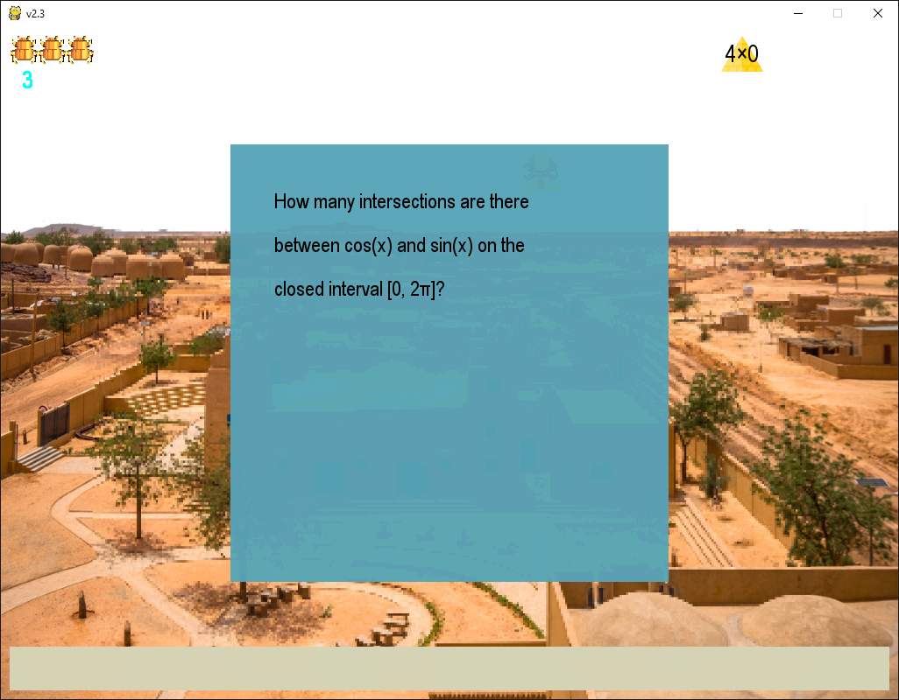

:warning: Everything between << >> needs to be replaced

# Math Around the World
## CS 110 Final Project
### Summer 2019
### [Assignment Description](https://docs.google.com/document/d/1d6wcXns0hz7HcUr4yF_tJK3QBx3daybmJO3dREPxABA/edit?usp=sharing)

GitHub repo: https://github.com/binghamtonuniversity-cs110/final-project-sum19-joke

Demo slides: https://docs.google.com/presentation/d/1rDWtDWjtYL9Nfr3gnet1xaAcVCrK4RSw-K7Ap_GiSVk/edit?usp=sharing

### Team: JOKe
#### Kimberly Meeker kmeeker2@binghamton.edu
#### Jae Kim jkim614@binghamton.edu
#### Yuqiao Huang yhuan171@binghamton.edu

***

## Project Description
This is a math game called 'Math Around the World.' In this game, you will see math problems with increasing difficulties. Hurry up! They are dropping down! Do not let the problems touch the ground or else you may lose the game. You will also have a chance to interact with cultural elements from China, Egypt, and Italy.

***    

## User Interface Design
* __Start Screen__
    
    * A start screen with a gif background and three buttons named 'START', 'RULES', and 'CREDITS.'
* __Rules Screen__
    * A screen with a gif background that shows how to play this game.
* __Credits Screen__
    * A screen with a gif background that shows credits and acknowledgements.
* __Menu Screen__
    
    * A menu screen with fixed background and three clickable 'tickets;' each leads users to a different 'country.'

* __Game Screen__
    * China
        
        * Game screen of China, with a unique background, a scoreboard and health bar in the top left corner, an answer type-in box at the bottom, and questions dropping down in the middle.
    * Egypt
        
        * Game screen of Egypt, with a unique background, a scoreboard and health bar in the top left corner, an answer type-in box at the bottom, and questions dropping down in the middle.
    * Italy
        
        * Game screen of Italy, with a unique background, a scoreboard and health bar in the top left corner, an answer type-in box at the bottom, and questions dropping down in the middle.
    * Popup Question
        
        * The popup questions that will appear if the user's score reaches a certain level.
    * Popup Question Graph
        
        * The graph of the popup question that will show up if users tap backquote key when they are on a popup question.

* __Result Screen__
    
    * A screen that shows how many points the user earned in the last game, with a clickable button that leads the user back to the start screen.

***        

## Program Design
* Additional Libraries
    * pygame
        * doc: https://www.pygame.org/docs/
        * description: A library that is primarily used to create games in a python environment.
    * numpy
        * doc: https://docs.scipy.org/doc/numpy/
        * description: A library that is primarily used for computing.
    * matplotlib
        * doc: https://matplotlib.org/
        * description: A library that is primarily used to draw graphs of functions.
    * SymPy
        * doc: https://www.sympy.org/
        * description: A library that is primarily used for symbolic mathematics, employing the mpmath library (http://mpmath.org/) for floating point arithmetic.

* Class structure
    

* __List of Classes__

  * __QuestionBox__ - This class produces sprites that display questions formulated by the QuestionGenerator. Instances are created at the top of the screen, and the goal of the game is for the user to answer each question correctly before its corresponding box reaches the bottom of the screen.

  * __AnswerTypein__ - This class produces a rectangle that displays the answer typed by the user.

  * __QuestionGenerator__ - This class works behind the scenes to generate the questions that are displayed in the Question Boxes.

  * __PopUpQuestionBox__ - This class displays bonus questions accompanied by visualizations.

  * __ScoreBoard__ - The instance of this class displays the user’s current score.

  * __HealthIcon__ - This class creates objects that represent the number of questions the user can get wrong before the game ends.

  * __MenuButton__ - The instances of this class denote areas where the user can click the mouse to switch between screens.

  * __Controller__ – This class initializes the game and mediates between the View and the Models, calling for updates to class state, screen presentation, and special effects in response to events and user input.

***

## Tasks and Responsibilities

### Software Lead - Yuqiao Huang

* Modules: Controller, QuestionBox, AnswerTypein, QuestionGenerator, PopUpQuestionBox, ScoreBoard, HealthIcon, MenuButton
* Others: ATP, background image for dropping problems

### Front End Specialist - Jae Kim

* Modules: Controller, ScoreBoard, HealthIcon, MenuButton
* Others: background music, background image for (start screen, menu screen, game screen, result screen), buttons' (start screen buttons, country selection buttons, start again button) graphical design, RULES page, CREDITS page

### Back End Specialist - Kimberly Meeker

* Modules: Controller, PopUpQuestionBox, ScoreBoard, HealthIcon, tests
* Others: ATP, sound effect & background music (menu screen, game screen, credit screen), docstring for each method, class structure, RULES page, CREDITS page

## Testing
* Scripted test
    * Test if scoreboard and question box generator is working properly.
* User based test
    * Test if the game goes as we want it to be.

### Menu Testing

* User based test
    * Let users try interacting with menu and test if the buttons on screen and keys on keyboard function normally.

### Game Testing

* User based test
    * Let users play our game and test if features in our game function normally.

* ATP

| Step                  | Procedure     | Expected Results  | Actual Results |
| ----------------------|:-------------:| :-----------------| -------------- |
|  1  | Open terminal, navigate to the final project folder, and type 'python3 main.py' in the terminal.  | 'Math Around the World' starts and displays the Menu Screen. Background music plays.  |  |
|  2  | Left click on 'RULES' button.  | 'Math Around the World' displays the Rules Screen. Background music plays. | |
|  3  | Tap 'ESC' key.  | 'Math Around the World' goes back to the Menu Screen. Background music plays. | |
|  4  | Left click on 'START' button.  | 'Math Around the World' displays the Country Selection Screen with buttons for China, Egypt, and Italy. Background music plays. | |
|  5  | Left click on 'China' button.  | 'Math Around the World' displays a game screen with China-themed background, icons, and music. In the upper left corner, a Health Bar displays 3 Health Icons, which represent the number of times the user can fail before the game ends, and a ScoreBoard, which is initially set to 0 for regular game play and will be updated as the user earns points. At the bottom left corner of the screen, there is a rectangular Answer Type-In Box for displaying the values typed by the user. Question Boxes with math problems begin descending from the top of the screen.  | |
|  6  | Type '100'.  | The number 100 appears in the Answer Type-In Box.  | |
|  7  | Tap 'BACKSPACE' key once.  | The final 0 will be removed from the number in the Answer Type-In Box, leaving '10'.  | |
|  8  | Press 'ENTER' key.  | The Answer Type-In Box clears. If 10 is the answer to the problem in the Question Box that is closest to the ground, the Question Box disappears and a chime sound plays. Otherwise, a buzzer sound plays, and the Question Box keeps falling. If a Question Box hits the ground before its correct answer is entered, a clunk sound plays and one Health Icon is removed from the Health Bar.  | |
|  9  |  Tap 'ESC' key.  | 'Math Around the World' goes back to the Country Selection Screen. Background music plays. | |
|  10 | Left click on 'Egypt' button.  | 'Math Around the World' displays a game screen with Egypt-themed background, icons, and music. In the upper left corner, a Health Bar displays 3 Health Icons, which represent the number of times the user can fail before the game ends, and a ScoreBoard, which is initially set to 0 for regular game play and will be updated as the user earns points. At the bottom left corner of the screen, there is a rectangular Answer Type-In Box for displaying the values typed by the user. Question Boxes with math problems begin descending from the top of the screen.  | |
|  11  | Type '-2.5'.  | The number -2.5 appears in the Answer Type-In Box.  | |
|  12  | Press 'ENTER' key.  | The Answer Type-In Box clears. If -2.5 is the answer to the problem in the Question Box that is closest to the ground, the Question Box disappears and a chime sound plays. Otherwise, a buzzer sound plays, and the Question Box keeps falling. If a Question Box hits the ground before its correct answer is entered, a clunk sound plays and one Health Icon is removed from the Health Bar. | |
|  13  |  Tap 'ESC' key.  | 'Math Around the World' goes back to the Country Selection Screen. Background music plays. | |
|  14  | Left click on 'Italy' button.  | 'Math Around the World' displays a game screen with Italy-themed background, icons, and music. In the upper left corner, a Health Bar displays 3 Health Icons, which represent the number of times the user can fail before the game ends, and a ScoreBoard, which is initially set to 0 for regular game play and will be updated as the user earns points. At the bottom left corner of the screen, there is a rectangular Answer Type-In Box for displaying the values typed by the user. Question Boxes with math problems begin descending from the top of the screen.  | |
|  15  | Type the correct answer to the problem in the Question Box that is closest to the bottom of the screen.  | The number typed appears in the Answer Type-In Box.  | |
|  16  | Press 'ENTER' key.  | The Answer Type-In Box clears. The Question Box disappears and a chime sound plays. The ScoreBoard is updated to 1. | |
|  17  | Type the correct answer to the problem in the Question Box that is closest to the bottom of the screen.  | The number typed appears in the Answer Type-In Box.  | |
|  18  | Press 'ENTER' key.  | The Answer Type-In Box clears. The Question Box disappears and a chime sound plays. The ScoreBoard is updated to 2. | |
|  19  | Type the correct answer to the problem in the Question Box that is closest to the bottom of the screen.  | The number typed appears in the Answer Type-In Box.  | |
|  20  | Press 'ENTER' key.  | The Answer Type-In Box clears. The Question Box disappears and a chime sound plays. The ScoreBoard is updated to 3. A Pop-Up Question Box appears on the screen. | |
|  21  | Press 'BACKQUOTE' key.  | A pop-up window appears with a visualization related to the question. | |
|  22  | Left click on the 'X' in the upper right corner of the pop-up visualization. |  The pop-up visualization closes.  | |
|  23  | Type the correct answer to the problem in the Pop-Up Question Box.  | The number typed appears in the Answer Type-In Box.  | |
|  24  | Press 'ENTER' key.  | The Answer Type-In Box clears. The Pop-Up Question Box disappears and the ScoreBoard is updated with an extra 5 points, for a total of 8. | |
|  25  |  Tap 'ESC' key.  | 'Math Around the World' goes back to the Country Selection Screen. Background music plays. | |
|  26  |  Tap 'ESC' key.  | 'Math Around the World' goes back to the Menu Screen. Background music plays. | |
|  27  |  Tap 'ESC' key.  | 'Math Around the World' closes. | |
|  28  | Adjust score in code to 29 and save the file.  | Score in code is changed to 29.  | |
|  29  | Open terminal, navigate to the final project folder, and type 'python3 main.py' in the terminal.  | 'Math Around the World' starts and displays the Menu Screen. Background music plays.  |  |
|  30  | Left click on 'START' button.  | 'Math Around the World' displays the Country Selection Screen with buttons for China, Egypt, and Italy. Background music plays. | |
|  31  | Left click on 'Italy' button.  | 'Math Around the World' displays a game screen with Italy-themed background, icons, and music. In the upper left corner, a Health Bar displays 3 Health Icons, which represent the number of times the user can fail before the game ends, and a ScoreBoard, which is now set to 29. At the bottom left corner of the screen, there is a rectangular Answer Type-In Box for displaying the values typed by the user. Question Boxes with math problems begin descending from the top of the screen.  | |
|  32  | Type the correct answer to the problem in the Question Box that is closest to the bottom of the screen.  | The number typed appears in the Answer Type-In Box.  | |
|  33  | Press 'ENTER' key.  | The Answer Type-In Box clears. The Question Box disappears and a chime sound plays. The ScoreBoard is updated to 30. Background music changes. | |
|  34  | Allow a total of 4 Question Boxes to hit the ground.  | 'Math Around the World' displays Game Over and shows the user's score.  | |
|  35  | Left click on 'Play Again' button.  | 'Math Around the World' goes back to the Menu Screen. Background music plays.  | |
|  36  | Left click on 'CREDITS' button.  | 'Math Around the World' displays credits and acknowledgements on the screen.  | |
|  37  | Left click on the 'X' in the upper right corner of the program window. | 'Math Around the World' closes.  | |
